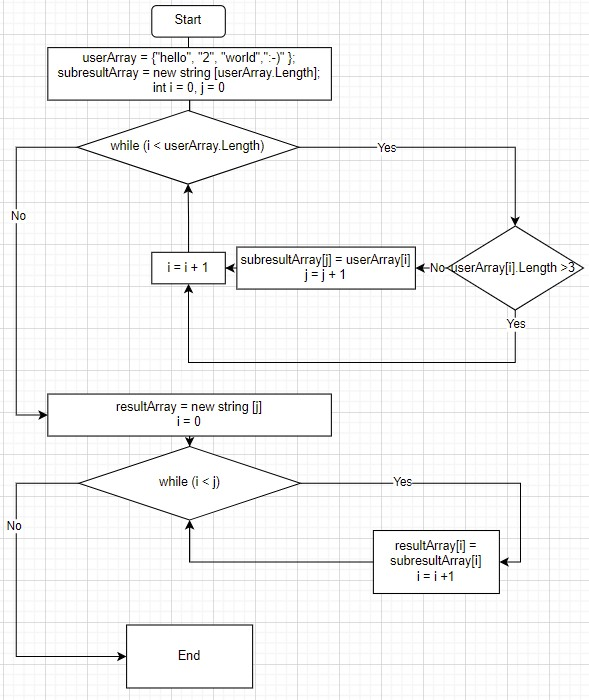

# Итоговая проверочная работа
Исполнитель: Сергеев Александр

**Задача**: Написать программу, которая из имеющегося массива строк формирует массив из строк, длина которых меньше либо равна 3 символа. Первоначальный массив можно ввести с клавиатуры, либо задать на старте выполнения алгоритма. При решении не рекомендуется пользоваться коллекциями, лучше обойтись исключительно массивами.

**Примеры**:

["hello", "2", "world", ":-)"] -> ["2", ":-)"]

["1234", "1567", "-2", "computer science"] -> ["-2"]

["Russia", "Denmark", "Kazan"] -> []

## Описание решения
1. Построение __*блок-схемы*__ основной части программы.

2. Реализация основного кода программы в C#:

    1. Создание основного метода *UserArrayElementsWithLt3Symbols*
        1. Использование первого цикла while для построения предварительного массива со строковыми значениями длинной менее либо равной 3 символам, но с размером равным размеру массива, заданному пользователем.
        2. Использование второго цикла while для построения финального массива со стороковыми значениями длинной менее либо равной 3 символам, с размером равным количеству таких элементов.
    2. Создание вспомогательного метода *PrintArray* (для вывода любых одномерных массивов)
    3. Тестирование программы на основе **Примеров** из **Задания**
3. Написание файла README.md для пользователей данной программы.

**Ссылка на GITHUB**: https://github.com/AlexServGE/FinalTestWork_1_Quarter
